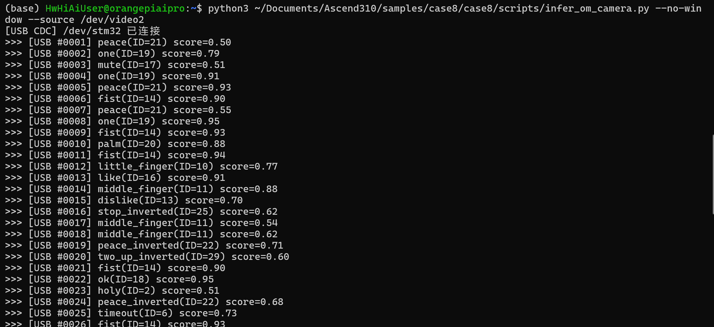

# 昇腾310B 手势识别驱动风扇控制系统

> **Ascend 310B Gesture Recognition Fan Control System**  
> 基于边缘AI视觉 + USB CDC通信 + 嵌入式控制的实时手势交互系统

[](https://www.hiascend.com/)
[](https://www.st.com/)
[](https://github.com/THU-MIG/yolov10)
[](https://www.hiascend.com/developer/)

---

## 项目概述

本项目设计并实现了一套**实时手势识别控制系统**：通过USB摄像头采集画面，在**昇腾310B（OrangePi AIpro）** NPU上运行YOLOv10n手势检测模型，识别34类手势，检测结果经消抖处理后通过**USB CDC虚拟串口**发送至**STM32F103C8T6**微控制器，STM32解析后输出PWM信号控制**风扇转速**与**双舵机摆风角度**。

### 系统架构

```
┌──────────┐     ┌──────────────────┐     ┌──────────────────┐
│  USB     │────▶│  昇腾310B (上位机) │────▶│ STM32F103 (下位机) │
│  摄像头  │     │  YOLOv10n NPU推理 │     │  PWM控制+执行     │
└──────────┘     └──────────────────┘     └────────┬─────────┘
                                                   │
                   USB CDC ACM (JSON)        ┌──────┴──────┐
                   协议: 换行分隔 JSON          │              │
                                         ┌────▼────┐   ┌────▼────┐
                                         │ SG90×2  │   │ L298N   │
                                         │ 摆风舵机│   │ 风扇驱动│
                                         └─────────┘   └─────────┘
```

**三层异构架构**：边缘AI视觉（昇腾310B）+ USB CDC通信 + 嵌入式控制（STM32F103）

---

## 核心功能

| 序号 | 功能 | 说明 |
|:----:|------|------|
| 1 | **手势检测与识别** | YOLOv10n_gestures在昇腾310B NPU上实时检测34类手势，20–25 FPS |
| 2 | **检测画面实时显示** | OpenCV在本地显示器实时叠加检测框、类别标签与置信度 |
| 3 | **GestureDebouncer消抖** | 三帧确认 + 去重 + 消失滞后，误触发率从~8%降至<1% |
| 4 | **风扇PWM无级调速** | 4档风速(CCR=300/500/700/900) + 开机/全关，L298N驱动 |
| 5 | **左右摆风控制** | SG90舵机，预判式折返算法，ok启动 / timeout停止 |
| 6 | **上下摆风控制** | SG90舵机，like启动 / dislike停止 |
| 7 | **系统状态机** | palm/stop开机 → fist全关机，控制指令仅在开机态生效 |
| 8 | **状态指示** | 板载PC13 LED收到手势数据时闪烁反馈 |
| 9 | **串口通信** | USB CDC虚拟串口，换行分隔JSON协议，115200波特率 |

---

## 创新点

### 1. 基于异构计算架构的边缘AI实时控制闭环

区别于传统的"摄像头+PC+单片机"方案，本系统采用"昇腾310B NPU + STM32 MCU"的异构架构，将AI推理卸载至专用NPU加速器，通过单一USB线缆同时承载CDC数据通信与设备供电，实现了**端侧推理->串行传输->嵌入式执行**的完整闭环。该架构在保证20-25 FPS实时推理性能的同时，将系统功耗控制在~25.5W，相比GPU方案功耗降低一个数量级，具备实际部署的能效优势。

### 2. 面向连续视频流的GestureDebouncer三级消抖机制

针对YOLOv10连续帧推理中固有的单帧假阳性（~8%误触发率）和类别抖动问题，本系统设计了一套轻量级的三级消抖流水线：（1）**三帧滑动确认窗口** -- 同一手势在窗口内出现>=2帧才通过确认，过滤孤立假阳性；（2）**发送去重缓存** -- 记录最后发送的手势ID，相同手势不重复触发通信，减少不必要的PWM更新和总线占用；（3）**消失滞后检测** -- 连续5帧无目标才判定手势消失，避免短暂遮挡导致控制中断。消抖后误触发率降至<1%，且额外延迟增量<100ms，在可靠性与响应速度之间取得了工程平衡。

### 3. 资源受限MCU端的嵌入式轻量JSON解析器

STM32F103C8T6仅配备20KB SRAM，无法引入cJSON等标准JSON库。本系统在`usbd_cdc_if.c`中实现了**基于字符串搜索的零依赖JSON字段提取器**，通过`strstr()`定位键名后按类型（int/float/string）直接解析值，全程无动态内存分配，代码体积<200行。该解析器在USB CDC中断上下文（RX Complete Callback）中逐字节接收、遇换行符触发解析，解析耗时在微秒级，不阻塞后续数据接收，从工程角度解决了资源受限MCU上结构化协议解析的难题。

### 4. 预判式舵机折返算法消除机械端点抖动

传统舵机扫描控制到达端点时，因PWM分辨率量化和机械惯性会产生明显的边界停顿与回摆抖动。本系统提出**预判式折返算法**：在每个10ms更新周期中，预先计算下一位置的CCR值；若预判值超出边界，则在本周期即执行折返并将CCR强制设定在边界内侧2个步长处（而非边界本身），使得舵机在接近端点时平滑转向，从控制算法层面消除了端点停顿与机械回差抖动。实验表明，算法使舵机扫描全程速度均匀，往返周期稳定在~5秒。

### 5. 基于有限状态机的安全控制逻辑

系统将风扇与舵机控制建模为**双态安全状态机**（OFF/ON）。palm(20)和stop(24)手势构成系统启动门控，fist(14)手势实现一键全关（风扇停转+双路舵机回中位），其余控制指令仅在ON态生效。该设计从逻辑层面杜绝了关机态下的误动作，系统意外断电后重启也默认处于安全的OFF态，符合嵌入式控制系统的安全设计原则。

---

## 实物展示

> 以下位置请插入对应的实物照片。建议图片存放于仓库 `docs/images/` 目录下，在README中使用相对路径引用。

<!-- [图1] 系统整机装配图 -->

*图1. 系统整机装配图 -- 昇腾310B + STM32 + L298N + 风扇 + 双舵机*

<!-- [图6] 系统联调演示 -->

*图2. 手势识别结果 -- 摄像头采集->NPU推理->USB传输->风扇/舵机响应*

---
*系统验证视频：* [【点击观看】昇腾310B 手势识别驱动风扇控制系统验证视频](https://www.bilibili.com/video/BV1dXNL6SELR/?share_source=copy_web&vd_source=5779e45563f79b2bc76cb2240d3fd884)
---
## 手势->动作映射

| 手势 | 类别ID | 控制动作 | 说明 |
|------|:------:|----------|------|
| palm / stop | 20 / 24 | **系统开机** | 风扇怠速(CCR=300)，舵机就位 |
| fist | 14 | **全关机** | 风扇停转，舵机回中位 |
| one | 19 | **风扇1档（低）** | CCR=300 |
| peace / two_up | 21/22/28/29 | **风扇2档（中低）** | CCR=500 |
| three / three2 | 26/27/5/30 | **风扇3档（中高）** | CCR=700 |
| four | 15 | **风扇4档（高）** | CCR=900 |
| ok | 18 | **左右摆风开** | 舵机1周期扫描 |
| timeout | 6 | **左右摆风关** | 舵机1停止复位 |
| like | 16 | **上下摆风开** | 舵机2周期扫描 |
| dislike | 13 | **上下摆风关** | 舵机2停止复位 |

> **34类完整手势**：grabbing, grip, holy, point, call, three3, timeout, xsign, hand_heart, hand_heart2, little_finger, middle_finger, take_picture, dislike, fist, four, like, mute, ok, one, palm, peace, peace_inverted, rock, stop, stop_inverted, three, three2, two_up, two_up_inverted, three_gun, thumb_index, thumb_index2, no_gesture

---

## 硬件组成

| 物料 | 型号/规格 | 用途 |
|------|----------|------|
| AI处理器 | Orange Pi AIpro（昇腾310B） | YOLOv10n NPU推理 |
| MCU | STM32F103C8T6 | PWM控制+USB CDC接收 |
| 摄像头 | USB摄像头 640×480 | 视频采集 |
| 电机驱动 | L298N | 风扇驱动 |
| 风扇 | 12V直流风扇 | 风量输出 |
| 舵机 ×2 | SG90 | 左右/上下摆风 |
| 电源 | 12V/3A适配器 | 系统供电 |

### 引脚分配

| STM32引脚 | 功能 | 连接目标 |
|-----------|------|----------|
| PA11/PA12 | USB_DM/DP | 昇腾310B USB口 |
| PA6 (TIM3_CH1) | 风扇PWM | L298N ENA |
| PB6 (TIM4_CH1) | 左右摆风PWM | SG90舵机1 |
| PB7 (TIM4_CH2) | 上下摆风PWM | SG90舵机2 |
| PB3/PB4 | GPIO输出 | L298N IN1/IN2 |
| PC13 | GPIO输出 | 板载LED指示 |

---

## 软件设计

### 上层（昇腾310B / OrangePi AIpro）

| 模块 | 文件 | 说明 |
|------|------|------|
| 主入口 | [`infer_om_camera.py`](code-final/infer_om_camera.py) | 命令行参数解析，初始化ACL后端与检测器 |
| 摄像头采集+推理 | [`camera.py`](code-final/camera.py) | 取帧→推理→消抖→发送，多线程+无锁环形队列 |
| USB CDC发送 | [`usb_sender.py`](code-final/usb_sender.py) | JSON行协议发送，100ms去重，置信度<0.5过滤 |
| ACL推理后端 | `hagrid_yolo/backends/acl_backend.py` | 昇腾CANN PyACL推理封装 |
| YOLO检测器 | `hagrid_yolo/detector.py` | 预处理→推理→后处理（NMS） |

**GestureDebouncer 三级消抖策略**：

| 策略 | 机制 | 效果 |
|------|------|------|
| 三帧确认窗口 | 滑动窗口长度3，同一手势≥2帧才确认发送 | 过滤单帧假阳性 |
| 确认后去重 | 记录最后发送ID，相同手势不重复发送 | 减少冗余PWM更新 |
| 手势消失滞后 | 连续5帧无检测才确认消失 | 避免短暂遮挡中断 |

### 下层（STM32F103C8T6）

| 模块 | 文件 | 说明 |
|------|------|------|
| 主循环+状态机 | [`main.c`](code-final/stm32_complete_code/Core/Src/main.c) | PWM控制逻辑，预判式折返，LED闪烁 |
| USB CDC接收+JSON解析 | [`usbd_cdc_if.c`](code-final/stm32_complete_code/USB_DEVICE/App/usbd_cdc_if.c) | 换行分隔接收，轻量JSON解析器 |
| 手势数据结构 | [`gesture.h`](code-final/stm32_complete_code/Core/Inc/gesture.h) / [`gesture.c`](code-final/stm32_complete_code/Core/Src/gesture.c) | 34类手势名称表，识别结果结构体 |

**PWM参数**：

| 参数 | 风扇 (TIM3) | 舵机 (TIM4) |
|------|:-----------:|:-----------:|
| PWM频率 | 1kHz | 50Hz |
| PSC | 71 | 143 |
| ARR | 999 | 9999 |
| 占空比/角度范围 | 0–100% (CCR 0–999) | 0°–180° (CCR 250–1250) |

**预判式折返算法**：每10ms更新一次舵机位置，更新前预计算next值，若越界则提前折返并强制弹离边界内侧2步长，从原理上消除端点停顿与抖动。

### 通信协议

```
物理层: USB CDC ACM (虚拟串口, /dev/stm32)
数据格式: 每行一个JSON对象，\n 作为帧分隔符
频率: ≤10Hz (100ms去重)
校验: USB BULK自带CRC16

示例: {"c":16,"n":"like","s":0.92,"x":320,"y":240,"w":120,"h":150}
```

| 字段 | 含义 | 类型 |
|------|------|------|
| `c` | 类别ID (0–33) | int |
| `n` | 手势名称 | string |
| `s` | 置信度 (0–1) | float |
| `x`, `y` | 边界框左上角坐标 | int |
| `w`, `h` | 边界框宽高 | int |

### 系统状态机

```
                  palm / stop
    ┌──────────────────────────────┐
    │                              │
    ▼                              │
┌───────┐       fist         ┌───────┐
│  OFF  │───────────────────▶│  ON   │
│ 关机态│                    │ 开机态│
└───────┘◀───────────────────└───────┘
                                  │
                   开机后可执行:    │
                   • 风扇调速 1-4档
                   • 左右摆风 开/关
                   • 上下摆风 开/关
```

---

## 测试结果

### 风扇控制测试

| 手势 | 预期动作 | PWM CCR | 结果 |
|------|----------|:-------:|:----:|
| palm (20) | 开机低速 | 300 | 通过 |
| one (19) | 1档低转速 | 300 | 通过 |
| peace (21) | 2档中低转速 | 500 | 通过 |
| three2 (26) | 3档中高转速 | 700 | 通过 |
| four (15) | 4档高转速 | 900 | 通过 |
| fist (14) | 关机停转 | 0 | 通过 |

### 舵机摆风测试

| 手势 | 预期动作 | 结果 |
|------|----------|:----:|
| ok (18) | 左右摆风开 | 通过 |
| like (16) | 上下摆风开 | 通过 |
| timeout (6) | 左右摆风关 | 通过 |
| dislike (13) | 上下摆风关 | 通过 |

### 性能指标

| 指标 | 数值 | 说明 |
|------|:----:|------|
| NPU推理帧率 | **20–25 FPS** | 640×640输入 |
| 手势检测准确率 | **>90%** | 光照良好条件 |
| 手势→风扇响应延迟 | **<200ms** | 含传输+解析+执行 |
| 消抖误触发率 | **<1%** | 消抖前~8% |
| 舵机扫描周期 | ~5s/往返 | 步长2, 10ms更新 |
| 系统功耗 | ≈25.5W | 12V适配器36W, 裕量29% |

---

## 快速开始

### 环境要求

- **昇腾310B (OrangePi AIpro)**：CANN 8.5+, Python 3.9+, OpenCV, pyserial
- **Windows/Linux开发机**：STM32CubeIDE, Keil MDK 或 Make + ARM GCC
- **模型**：`YOLOv10n_gestures.om`（OM离线模型, YOLOv10n导出）

### 1. 部署昇腾310B端

```bash
# 安装依赖
pip install opencv-python pyserial numpy

# 配置udev固定STM32设备名
sudo cp 99-stm32.rules /etc/udev/rules.d/
sudo udevadm control --reload-rules && sudo udevadm trigger

# 运行手势识别（无窗口模式，自动发送USB CDC）
python infer_om_camera.py \
    -m models/YOLOv10n_gestures.om \
    -s /dev/video0 \
    --no-window \
    --camera-width 640 --camera-height 480
```

### 2. 烧录STM32固件

```bash
# 使用STM32CubeIDE打开工程并编译下载
# 或使用命令行工具
cd stm32_complete_code
make -j$(nproc)
st-flash write build/gesture_fan.bin 0x08000000
```

### 3. 系统联调

1. USB摄像头连接到昇腾310B
2. STM32通过Micro-USB连接昇腾310B USB口
3. L298N连接风扇，SG90舵机接PB6/PB7
4. 12V电源供电
5. 在310B上启动推理程序
6. 对着摄像头做手势即可控制风扇

---

## 项目结构

```
项目：手势识别驱动风扇/
├── README.md                          # 本文件（验收报告）
├── 系统设计文档.md                      # 系统设计详细文档
├── 项目功能报告书.md                    # 功能说明 + 测试报告
├── 个人报告1.pdf                       # 个人研究报告
├── docs/images/                       # 实物照片与测试截图
├── code-final/                        # 最终交付代码
│   ├── infer_om_camera.py             # 昇腾310B 主入口
│   ├── camera.py                      # 摄像头采集 + 推理 + 消抖 + 发送
│   ├── usb_sender.py                  # USB CDC JSON发送模块
│   ├── hagrid_yolo/                   # YOLOv10检测框架
│   │   ├── backends/acl_backend.py    # ACL NPU推理后端
│   │   ├── detector.py               # YOLO检测器
│   │   ├── metadata.py               # 标签/分辨率元数据
│   │   └── visualization.py          # 检测框可视化
│   └── stm32_complete_code/           # STM32完整工程
│       ├── Core/
│       │   ├── Inc/gesture.h          # 手势数据结构头文件
│       │   ├── Src/gesture.c          # 手势名称表
│       │   ├── Src/main.c             # 主循环(PWM+状态机)
│       │   └── Src/stm32f1xx_it.c     # 中断服务
│       ├── USB_DEVICE/App/
│       │   ├── usbd_cdc_if.h          # CDC接口头文件
│       │   └── usbd_cdc_if.c          # CDC接收+JSON解析
│       ├── Drivers/                   # HAL库驱动
│       └── Middlewares/               # ST USB协议栈
└── code-final/stm32_complete_code - 副本/  # STM32工程备份
```

---

## 项目进度

| 阶段 | 时间 | 内容 | 状态 |
|------|------|------|:----:|
| 环境搭建 | 6月下旬 | CANN环境+PyACL推理环境 | 完成 |
| 中期检查 | 7/2-7/6 | 电机驱动接入，全链路联调，端到端延迟<150ms | 完成 |
| 第一次验收 | 7/7-7/9 | 系统集成优化，整机装配 | 完成 |
| 最终验收 | 7/9-7/10 | 整改优化，结题答辩 | 完成 |

---

## 贡献者

| 姓名 | 分工 |
|------|------|
| 陈佩欣 | 昇腾310B端AI推理+USB CDC发送模块 |
| 关博仁 | STM32嵌入式控制+USB CDC接收模块 |
| 共同 | 硬件连接+系统联调+文档撰写 |


---

> **项目来源**：嵌入式AI课程设计 | 2026年春季学期
> **指导教师**：周贤中
> **完成日期**：2026年7月9日
